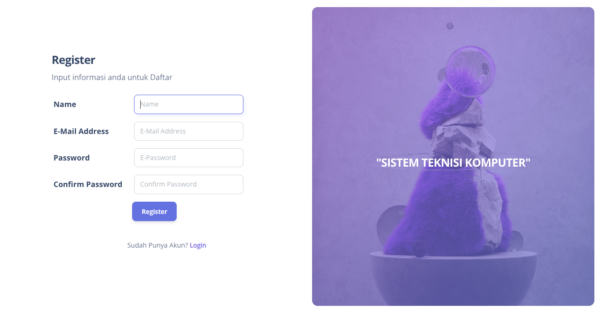

# Sistem
project Sistem Teknisi Komputer
by : hasanarofid

## Sistem Teknisi Komputer

### Features Role User


### Installation
1. Clone the repository using the command "git clone [link]"
2. Create database in MySql
3. Configure the .env file accordingly
4. Run command 
```
$composer install
$php artisan migrate
$php artisan db:seed
$php artisan serve
$php artisan storage:link
```

### Built With
* Bootstrap- CSS framework
* JQuery- Javascript framework
* Laravel - PHP framework
* MySql- Databse

### Progress fitur 13/7/2023

## login 5 role
* HRD (done)
* Teknisi (done)
* Marketing (done)
* Admin (done)
* User/Pelanggan (done)

### Progress fitur 14/7/2023
## Improve panel admin
* demo




### Progress fitur 15/7/2023
## menu berdasarkan login 5 role
* HRD 
* Teknisi 
* Marketing 
* Admin 
* User/Pelanggan 

## demo